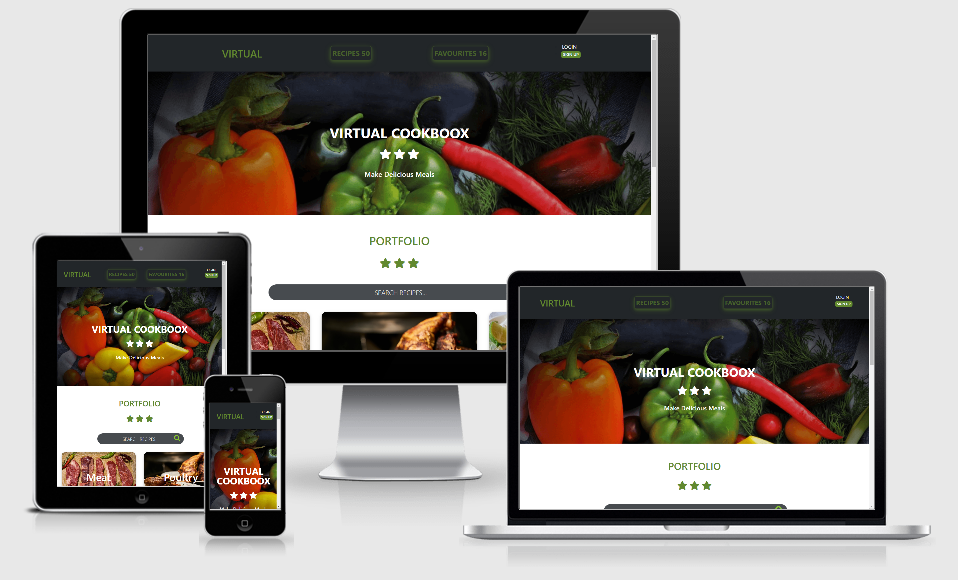

# Virtual Cookboox

Virtual Cookboox has been designed for people of all cooking capabilities to help produce delicious and wholesome meals. This application provides quick and intuitive access to recipes borne out of selected food genres.

If you are struggling for time to cook, notice on preparation and cooking time is made clear. Diet conscious consumers can view the calories per serving numbers to help plan for the right recipe.

Finally, logged in users can add new recipes to this application by simply clicking on 'Add Recipe' at the top of the screen. Favourite recipes can be recorded, existing recipes can be edited and unwanted recipes can be deleted. All at the users fingertips.

## Demo
A live demo can be found [here](https://virtual-cookboox.herokuapp.com/).

***

## Table of Contents
1. [UXD Considerations](#uxd-considerations)
    * [User](#user)
    * [Virtual Cookboox](#virtual-cookboox)
    * [Wireframes](#wireframes)
    * [User Stories](#user-stories)
    * [Schema](#schema)
    * [CSS Framework](#css-framework)
    * [Colour Palette](#colour-palette)
    * [Typography](#typography)
    * [Icon Graphics](#icon-graphics) 
2. [Information Architecture](#information-architecture)
    * [Application Framework](#application-framework)
    * [Database](#database)
    * [Data Models](#data-models)
3. [Database inc Source Data](#database-inc-source-data)
4. [Technologies Applied](#technologies-applied)
    * [Languages](#languages)
    * [Libraries](#libraries)
    * [Tools](#tools)
    * [Hosting](#hosting)
5. [Virtual Cookboox Summary Functions](#virtual-cookboox-summary-functions) 
6. [Features](#features)
    * [Features Left to Implement](#features-left-to-implement) 
7. [Tests](#tests)
8. [Deployment](#deployment)
    * [Deployment To Heroku](#deployment-to-heroku)
    * [Local Deployment](#local-deployment)
9. [Credits](#credits)
    * [Content](#content)
    * [Media](#media)
    * [Acknowledgements](#acknowledgements)

## UXD Considerations
### Ambition

#### User
A thorough registration process lies in waiting for the user to secure their personal credentials, prior to access the website home page. All data entry requests are mandatory, with controls to support integrity of data entry. This process will provide the user with an acceptable level of assurance that unauthorised access to their recipe data will not be tolerated.     

The website design encourages the user to access both modern and traditional recipes via clear signposting of 6 food genres (Meat, Poultry, Fish, Vegetables, Grains & Pasta). The intention is for these sub-portals to take over from 'type & search' to reduce user thinking time on what to find and replaced by a seduction of great images and narrative.

Furthermore, the user can extend their amazing personal experience to edit existing recipes, should they seize the opportunity to improve the recipe. New recipes can be added by the user via a button click from the host page navbar. Data entry has been made easy with placeholder text visible in all data input boxes, with careful attention placed upon the quality of data entry and subsequent compatability with backend storage in the cloud. Both new and existing recipes can be flagged as a favourite or deselected through the click of a simple tickbox. 

Unwanted recipes can be deleted through a 'one and done' button click. This button has been painted red for the user to view as a danger sign post. For this application release, deleted recipes are non-recoverable. 

Time waits for no one. Therefore, all recipes include mandatory preparation and cooking times to help the user plan for meals that fit in with their current lifestyle. Diet conscious users have access to calory count data, with the numbers based upon per food serving.    

Imagery and recipe narrative selected throughout the site design has been mostly sourced from BBC Good Food Guide to establish an excellent provenance, enjoyable viewing experience using quality ingredients and generate confidence to produce delicious meals. Integrity of recipe design is maintained by including the originating recipe authors' name.

A summary of total recipes and total favourite recipes is on view in the navbar, irrespective of where the user finds themself in the website.

Finally, the 'Virtual Cookboox' navbar brand is configured to move the user back to the home page and should be used upon completion of a recipe edit or when the user wants to view all 6 food genre categories. 

#### Virtual Cookboox
- Provide a simple and intuitive site for the user to click, search, add & delete both modern & traditional cooking recipes, where age is no barrier to entry. 
- On a personal note, creating a multi-layered learning and practice experience in frontend and backend programming. Substantial effort and desire to integrate the use of HTML5, CSS3, Bootstrap4, JavaScript, Python3, MongoDB Atlas, Flask and Jinja.
- Nest stage generation is to move on from a personal recipe application to enterprise scale where professional kitchens and learning institutions leverage the power of code in the cloud to access quality recipes to create industry best practice and blue print models for recipe innovation.  

## Wireframes
My [wireframe mock up design](https://github.com/Spagettileg/virtual-cookboox/blob/master/wireframes/virtual-cookboox-vfinal.pdf) has been developed as a fully responsive application capable of running on mobile, tablet & desktop devices. All mock up material was created in Balsamiq and has been appended as .bmpr file on GitHub. The mock up design has stayed consistent with the original planning. 

## User Stories
> I need an app that provides quick and intuitive access to recipes across the globe [READ]

> I don’t have much time for cooking in the week, so I need to understand time taken to cook quality meals [READ]

> Some of my friends are worried about calory content in their food. I need to understand calory content per recipe serving {READ]

> I'd like to upload new recipes and contribute to existing recipes, to share my love and passion for good, wholesome eating [CREATE & UPDATE]

> I want to remove unwanted recipes from my collection [DELETE]

> My recipes must be kept in a secure environment and protected from unauthorised edit & or deletion [UPDATE & DELETE]

## Design
### Schema
My [schema](https://github.com/Spagettileg/virtual-cookboox/blob/master/schema/schema-plan-v1.pdf) was developed through de-engineering of the User Stories to then produce a conceptual design model. This model then formed the foundation to the project data requirements and ultimately the build of a database and the rules governing the use of the data. The schema design has evolved during the course of the project as better information and knowledge of database technology improved.

### Application Framework
Flask application framework was a prerequisite in the design of this project, according to the project brief.

### Database
MongoDB Atlas NoSQL database was used for this project. Key reason supporting my selection was the database was highly scalable and stores data is non-relational format. The data collections format is very well conditioned to support JSON files via the 'Key':'Value' structure and was a good fit to house my recipe raw data. The same data can be easily stored across multiple servers in the cloud.

The database consists of the following collections:
1. Categories - Meat, Poultry, Fish, Vegetables, Grains & Pasta
2. Tasks - List of key value pairs that are consistent per recipe record
3. Users - Users name and password

### CSS Framework
Bootstrap 4 was the chosen framework for styling my project. I used the bootstrap grid extensively to support responsiveness on mobile, tablet and desktop devices. Materializecss had featured as part of my earlier work in this project, but I lost valuable developer time with code conflicting with Bootstrap 4. The latter was dropped with Bootstrap 4 given sole exclusivity rights to the formatting of my project. 

### Colour Palette
Colours used in this project were sourced from [Gorgeous Contrast](https://visme.co/blog/website-color-schemes/) palette in visme.com. Essentially, various shades of green and black worked well with the multiple array of colours that were present in the food recipe imagery.

### Typography
Monserrat & Lato fonts were used throughout this project. H1 header was used in the home page to announce Virtual Cookboox brand to the user. Thereafter, H2 & H3 was used for sub-heading narrative, with H6 being used user information guide purposes to understand the function of both edit recipe & delete recipe buttons.

Font-weight of 500 & 700 was used to help draw attention to the user for both branding and instruction too.

### Icon Graphics
Font Awesome 5 icon graphics were used in conjunction with Bootstrap 4, primarily in the design of the recipe detail page, including edit and add recipe pages too.

- authors name = `fas fa-user`
- complexity = `fas fa-graduation-cap`
- preparation time - `far fa-clock`
- cooking time - `far fa-clock`
- calories - `fas fa-weight`
- servings - `fas fa-users`
- brief description, ingredients & instructions - `far fa-file-alt`
- recipe image - `far fa-file-image`

## Database inc Source Data
[BBC Good Food Guide](https://www.bbcgoodfood.com/recipes) was the source of the raw project data. I manually keyed the raw data into MongoDB database via Virtual Cookbook Tasks collection, adopting the key valuie pair approach. Both `MONGO_URI` and `MONGO_DBNAME` database were configured in the flask application and the import of PyMongo library enabled the injection of cloud server data into the Flask application. 

## Technologies Applied
### Languages
•	[HTML5](https://html.spec.whatwg.org/multipage/) used as the markup language

•	[CSS3](https://www.w3.org/Style/CSS/) used to style the HTML

•	[JavaScript](https://developer.mozilla.org/en-US/docs/Web/JavaScript) used mostly for DOM manipulation

•	[Python3](https://www.python.org/) used to run the backend application

### Libraries
•	[Font Awesome](https://fontawesome.com/) v5.8.2 to provide the icon set

•	[Google Fonts](https://fonts.google.com/) provided the fonts used throughout the project

•	[jQuery](https://jquery.com/) is used to manipulate the DOM, for example buttons, and showing / hiding elements

•	[Flask](https://flask.palletsprojects.com/en/1.1.x/) v1.0.2 is the micro web framework that runs the application

•	[PyMongo](https://flask-pymongo.readthedocs.io/en/latest/) 2.3.0 was used to enable the python application to access the Mongo database

•	[Jinja](https://jinja.palletsprojects.com/en/2.10.x/) v2.10.1 is the default templating language for flask and is used to display data from the python application in the frontend html pages

### Tools
•	[AWS Cloud9](https://aws.amazon.com/cloud9/) a cloud-based integrated development environment (IDE) that lets you write, run, and debug your code with just a browser.

•	[MongoDB Atlas](https://www.mongodb.com/cloud/atlas) global cloud database service for modern applications providing availability, scalability, and compliance with the most demanding data security and privacy standards.

•	[Git](https://git-scm.com/) is a free and open source distributed version control system designed to handle everything from small to very large projects with speed and efficiency.

•	[GitHub](https://github.com/) is a code hosting platform for version control and collaboration. It lets you and others work together on projects from anywhere.

•	[Balsamiq](https://balsamiq.com/) is a small graphical tool to sketch out user interfaces, for websites and web / desktop / mobile applications and used to visualise my project through mock-up design.

### Hosting
•	[Heroku](https://heroku.com) is used to host the deployed application - 'virtual cookbook'

## Virtual Cookboox Summary Functions

## Features
### Feature 1 - Registration & Authentication 

•	User has a mandatory requirement to complete the registration & authentication form when clicking on the sites url address 

•	Register & Login data entry requirements include username and password. Where appropriate, data entry governance exists in the form of required attributes meaning all requests for data must be completed prior to access the full Virtual Cookboox website   

•	All usernames and passwords will be unique to avoid unauthorised access to third party recipes

•	Logged in users will have access to their own recipes with full rights to create, edit and delete recipes  

### Feature 2 - Navbar brand logo 

•	Normal html convention rules followed by placing the navbar brand logo 'Virtual Cookboox' in the navbar, at the top left corner. The User has unhindered access to this logo and when clicked, will always return the user to the homepage.  

### Feature 3 - Recipe counter

•	A read only view created to show a count of all recipes that have been added to the Virtual Cookboox . The cursor has been set to none when the User hovers over the counter

•	The counter will be activated by the User should they add a recipe (+1) or delete a recipe (-1). The counter will not fall below zero 

### Feature 4 - Favourite recipe counter

•	A read only view created to show a count of all favourite recipes that have been added to the Virtual Cookboox The cursor has been set to none when the User hovers over the counter    

•	The counter will be activated by the User should they elect to tick the 'favourites box' contained in either the 'add recipe' or 'edit recipe' pages. The counter will increment (+1) if the box is ticked or reduce (-1) if the box is unticked. The counter will not fall below zero 

### Feature 5 - Search recipe 

•	All users will have access to Virtual Cookboox recipes via use of a free text key in from the user

•	Search results will provide a count of the recipes found

### Feature 5 - Add recipe 

•	Logged in users can click on 'Add Recipe' button located at top right of the navbar. The navbar is present on all pages in the website, following completion of the registration process  

•	Once button has been clicked, the User is presented with a clear and intuitive data entry form with guidance provided by placeholder text. All input boxes are required to be completed, otherwise the User will receive a mandatory warning message to complete. Incomplete recipes cannot be added to Virtual Cookboox 

•	Information required from the User includes food genre, recipe complexity, recipe name, author name, recipe preparation time, recipe cooking time, calories per serving, brief description of the recipe, full list of ingredients, detailed instructions on how to cook, url web address for a recipe image & a tickbox for favourite recipes       

•	Once all required recipe information added, the User should click 'Submit' button. User is then routed back to homepage  

•	New recipe can be viewed by clicking on food genre image relative to the recipe that has been added

### Feature 6 - Overview of Virtual Cookboox 

•	An elevation statement has been created to promote Virtual Cookboox to the User to set out its purpose, value generators, responsive to user stories and reference to key features  

### Feature 7 - Food genre image portal gateway

•	Portal access for both logged and unlogged users  

•	Six fully responsive images of different food genres on display for the User. Images of meat, poultry, fish, vegetables, grains & pasta are clickable and will migrate the User to the respective recipe collection  

•	To save on any confusion, all images have been name tagged  

### Feature 8 - Food genre recipe collection 

•	Portal access for both logged and unlogged users

•	A Recipe image, recipe name, brief description and a recipe detail button are displayed in a card style. This structure is then repeated for all recipes 

•	If the User likes a certain recipe after reading the summary information, then they can simply click the 'Detail' button to find out much more information

•	There is every chance the User does not find the recipe they're looking for. In this instance, the User can elect to add a recipe of their own or exit the Virtual Cookbook  

### Feature 9 - Detailed recipe card 

•	Portal access for both logged and unlogged users

•	User will be presented with an individual recipe card containing a recipe image, recipe name, brief description of the recipe, icon graphic & authors name, icon graphic & complexity (Easy or Challenge), icon graphic & preparation time, icon graphic & cooking time, icon graphic & calories, icon graphic & servings, full list of Ingredients & detailed Instructions on how to cook

•	Should the recipe content be fine with User, then User can follow next steps, as follows:

1.	Click back page control to revisit summary recipe selection page
2.  Click on the navbar brand logo 'Virtual Cookboox' to return to home page
3.  Leave the application by using normal browser control

•	Only logged in users will have access to both [Edit](#edit-recipes) and [Delete](#delete-recipes) recipe material 

### Feature 10 - Edit recipe 

•	Logged in users can click on 'Edit Recipe' button located at the bottom of the recipe detail page   

•	Once button has been clicked, the User is presented with all the recipe information in a series of dropdown and input boxes  

•	Information to be updated by the User includes food genre, recipe complexity, recipe name, author name, recipe preparation time, recipe cooking time, calories per serving, brief description of the recipe, full list of ingredients, detailed instructions on how to cook, url web address for a recipe image & a tickbox for favourite recipes       

•	Once all updated recipe information added, the User should click 'Submit' button. User is then routed back to the recipe detail page showing an updated view of the recipe  

### Feature 11 - Delete recipe 

•	For unwanted recipes, the logged in user can click on 'Delete Recipe' button located at the bottom of the recipe detail page  

•	Once button has been clicked, the User has committed to complete removal of the recipe record, with no reversal. Thereafter, the User is routed to the homepage  

### Feature 12 - Favourite recipe tickbox 

•	Logged in user to navigate to either 'Edit Recipe' or 'Add Recipe' page to mark their given recipe as a favourite. A simple tickbox has been created to record the User actions in both the application and cloud database too. Tick for favourite and untick for non-favourite   

•	Summary favourite count statistics can be viewed in the navbar by both logged in and non-logged in users. The cursor has been set to default as the data is only intended for read only purposes   

### Feature 13 - Footer 

•	Provides a social media link to LinkedIn and a link to my GitHub page. Fonts (icons) secured from bootstrap 4 / font awesome 5. The links are wired to the website designers’ respective social media sites. A .hover pseudo class has been used to provide a background colour change (light grey to corporate colour code) and font colour change too.   

•	Contact link embedded into the conatact section that enables the user to send requests for software development support direct to website authors LinkedIn account 

### Feature 14 - 404 alert page

•	Provides a friendly sign post for the user in the event an incorrect link has been clicked and the user has the option to click back into a correct link

### Feature 15 - My Recipes page

•	Logged in users are allocated their own portal space to view their gravatar image, own recipe count and collection of recipes added by the user. The logged in user can also view the detail of each of their recipes and seek to edit or delete the same 

•	All recipes added by the logged in user will appear in their respective portal space in addiiton to generic portal space that can be viewed only by other users  

### Features Left to Implement

- Breakfasts, Hors D'oeuvre's, Starters and Desert recipes to be included for a future release
- Deleted recipes to be reversed by the user, in the event human error was responsible for the original recipe deletion 
- A dedicated favourite recipes page that allows the user to view collectively and in detail
- Additional food genres that relate to cuisine by location. The list is will be quite extensive and could be developed by creating a new 'key value' field, per record held in cloud database. For example;
    - `country_name': "Chinese"`
    - `country_name': "Italian"`
    - `country_name': "Indian"`
    - `country_name': "Mexican"`

## Testing
Test analysis and reporting can be viewed in a separate [TESTS.md](https://github.com/Spagettileg/virtual-cookboox/blob/master/TESTS.md) file.

## Deployment

### Deployment to Heroku
The site has been formally deployed to [Heroku](https://virtual-cookboox.herokuapp.com/) and the latest version of my application can be found here. The following steps were taken in order to deploy:

#### AWS Cloud 9 IDE
- I created a secret_key within .bashrc and heroku so I could still run the project from my own IDE and the security of the password be preserved
- MongoDB Atlas, upon creation of a cluster & database, created a connection string to be copied into both .bashrc and heroku
- Flask debugging turned off by setting debug=False
- Requirements.txt file created with the command `sudo pip3 freeze --local > requirements.txt`. This is essential
- Procfile created withthe command `echo web: python app.py > Procfile`
- Push all my latest production ready code to GitHub ready for deployment via Heroku's GitHub function where you can deploy from GitHub the production ready app

#### Heroku
- From the Heroku dashboard I created a new app, using the name virtual-cookboox and set the region to Europe
- In the settings tab I clicked reveal config vars and entered the required environment variables, which in this case were:
    - Key = `IP`: Value = `0.0.0.0`
    - Key = `PORT`: Value = `5000`
    - Key = `SECRET`: Value = `************`
    - Key = `MONGO_URI`: Value = `mongodb+srv:\\root:passwordatmyfirstcluster-52qvv.mongodb.net/virtual_cookbook?retryWrites=true&w=majority`
    - On the deploy tab, in the Deployment method section I chose deploy from AWS Cloud 9 IDE via command `git push heroku master`

#### Local Deployment
##### Via GitHub
- Manually download the application locally to your machine and then upload to your preferred IDE
- Install the projects requirements.txt using `pip3 install -r requirements.txt`
- A few environment variables need to be updated before you can run the app:
    - `app.secret_key = os.getenv("SECRET")` 
    - `app.config["MONGO_URI"] = os.getenv("MONGO_URI")`
    - `app.config["MONGO_DBNAME"] = "virtual_cookboox"`
- Once the above steps are complete you can try run the application using `python3 recipe.py`

##### Via the CLI
- Clone my repo via Git using the following command `https://github.com/Spagettileg/virtual-cookboox.git`
- Install the projects requirements.txt using `pip3 install -r requirements.txt`
- A few environment variables need to be updated before you can run the app:
    - `app.secret_key = os.getenv("SECRET")` 
    - `app.config["MONGO_URI"] = os.getenv("MONGO_URI")`
    - `app.config["MONGO_DBNAME"] = "virtual_cookboox"`
- Once the above steps are complete you can try run the application using `python3 recipe.py` 

## Credits

### Content
All code content in this software was written by me, with the expection of the following:
- Reformatting of [Textarea](https://alistapart.com/article/expanding-text-areas-made-elegant/) was supported by code sourced from Neil Jenkins. Under normal circumatances, HTML & CSS are not geared up for responsive formatting of textarea, hence a specialist Javascript code snippet was found and implemented.   
- [User registration](https://www.w3schools.com/howto/howto_js_form_steps.asp) code snippet sourced from W3Schools.com. Additional formatting and creation of required attributes was written by myself.

### Media
- Food genre immages were taken from [pixabay](https://www/pixabay.com), a royalty free stock image library.

- Food recipe image url links were taken from [BBC Good Food Guide](https://www.bbcgoodfood.com/recipes).

- Favicon image was sourced from [pixabay](https://www/pixabay.com).

### Acknowledgements
Theo Despoudis (Mentor) - For his guidance with the process of delivering my project and reminders for keeping the code simple, yet effective. 

Slack Community and the following experts to keep me honest and focused.

Haley Schafer - Tutor,
Niel Mcewen - Tutor &
Michael Park - Tutor

**This is for educational use.** 